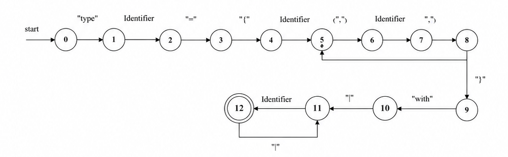
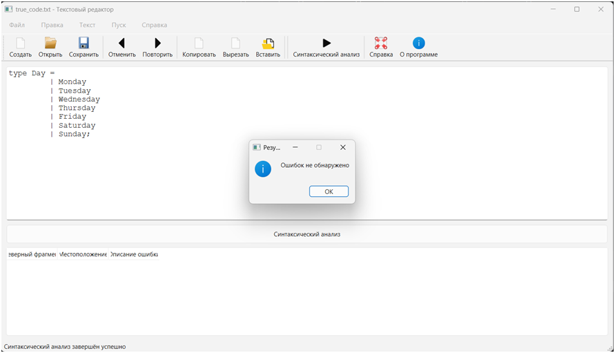
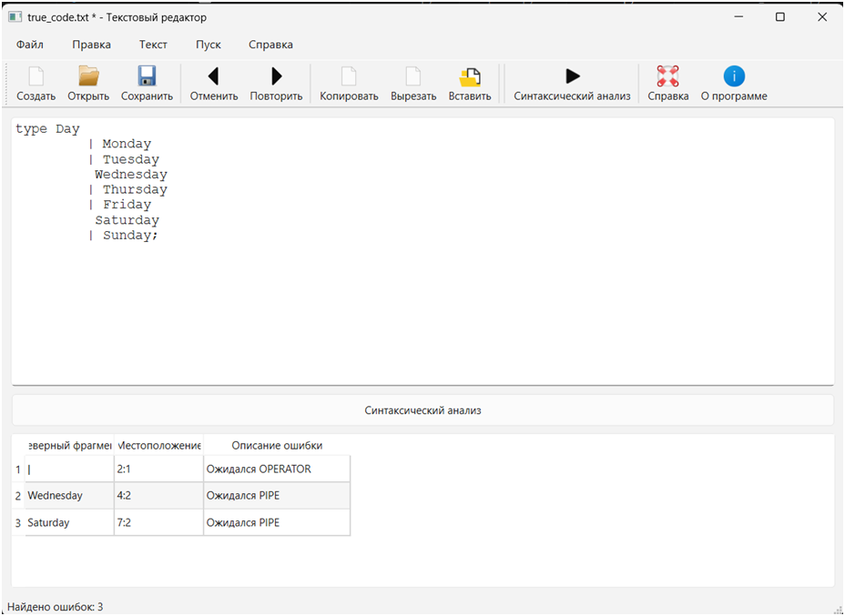
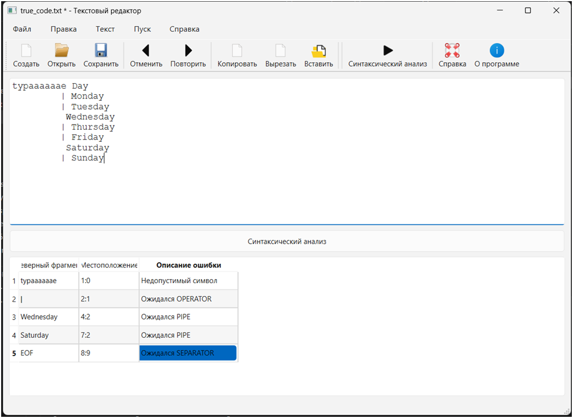

## Лабораторная работа №1

## Название и цель работы
**Название:** Текстовый редактор с языковым процессором  
**Цель работы:** Создание кроссплатформенного графического интерфейса (GUI) для языкового процессора в виде специализированного текстового редактора.

## Сведения об авторе
- **Студент:** Семешко Анастасия
- **Курс:** 3
- **Группа:** АП-326
- **Факультет:** АВТФ
- **Год:** 2026

## Описание проекта
Данное приложение представляет собой текстовый редактор с графическим интерфейсом, разработанный как основа для будущего языкового процессора. Редактор поддерживает стандартные операции с текстовыми файлами и имеет специальную область для вывода результатов синтаксического анализа.

Интерфейс содержит четыре основные области:
1. Основное меню программы
2. Панель инструментов с кнопками быстрого доступа
3. Область ввода/редактирования текста
4. Область отображения результатов (только для чтения)

Пользователь может изменять размеры всех областей, автоматически появляются полосы прокрутки.

## Используемые технологии
- **Язык программирования:** Python 3.11
- **GUI фреймворк:** PyQt6 6.5.0
- **Среда разработки:** VS Code / PyCharm
- **Сборка:** PyInstaller 6.0.0

## Инструкция по сборке и запуску

### Запуск из исходного кода
1. Установить Python 3.9 или выше
2. Установить зависимости:
   ```bash
   pip install PyQt6
3. Запустить приложение: python main.py
Сборка исполняемого файла:
pip install pyinstaller
pyinstaller --onefile --windowed --name "TextEditor" --add-data "examples;examples" main.py

Для запуска готового .exe
1. Перейти в папку dist
2. Скопировать TextEditor.exe в любое место (рабочий стол, флешка)
3. Дважды кликнуть для запуска
(Приложение не требует установленного Python или дополнительных библиотек!)

## Описание интерфейса и функций (руководство пользователя):
1. После успешного запуска .exe откроется главное окно редактора.
Главное меню программы имеет следующую структуру:
1) Файл
a. Создать - Создание нового документа
b. Открыть - Открытие существующего файла
c. Сохранить - Сохранение текущего документа
d. Сохранить как - Сохранение под новым именем
e. Выход - Выход с проверкой сохранения
2) Правка
a. Отменить - Отмена последнего действия
b. Повторить - Повтор последнего действия
c. Вырезать - Вырезание выделенного текста
d. Копировать - Копирование выделенного текста
e. Вставить - Вставка текста из буфера
f. Удалить - Удаление выделенного текста
g. Выделить все - Выделение всего текста
3) Текст
a. Постановка задачи - Информация в область вывода
b. Грамматика - Описание грамматики
c. Классификация грамматики 
d. Метод анализа
e. Тестовый пример
f. Список литературы - Библиография
g. Исходный код программы - Информация о коде
4) Пуск
a. Запустить синтаксический анализ
5) Справка
a. Вызов справки - Руководство пользователя
b. О программе - Информация о программе
## Скриншоты

1. Главное окно программы


2. Диалог сохранения


## Ограничения
Языковой процессор: реализована тестовая версия (подсчет символов/слов)
Поддерживаемые форматы: только текстовые файлы (.txt) в кодировке UTF-8
Размер файлов: не рекомендуется открывать файлы более 100 МБ
Кроссплатформенность: собранный .exe работает только на Windows
Системные требования: требуется Visual C++ Redistributable 2015-2022


## Лабораторная работа 2. Разработка лексического анализатора (сканера)
Цель работы.
Изучить назначение и принципы работы лексического анализатора в структуре компилятора. Спроектировать алгоритм (диаграмму состояний) и выполнить программную реализацию сканера для выделения лексем из входного текста. Интегрировать разработанный модуль в ранее созданный графический интерфейс языкового процессора.

Сведения об авторе.
Выполнила:
Студент гр.АП-326 АВТФ Семешко Анастасия

Постановка задачи: 
Разработать лексический анализатор (сканер) в соответствии с индивидуальным вариантом задания, интегрировать его в приложение из лабораторной работы №1 и обеспечить наглядный вывод результатов.

Требования к реализации сканера:
Спроектировать диаграмму состояний конечного автомата, реализующего сканер, согласно варианту задания.
Разработать программный модуль лексического анализа, который:
1. принимает на вход строку (исходный текст программы);
2. выделяет все допустимые лексемы согласно варианту;
3. классифицирует лексемы по типам (например: "ключевое слово", "идентификатор", "число", "оператор", "разделитель").
4. любые символы, не соответствующие ни одному из допустимых типов лексем, считать недопустимыми и выводить сообщение об ошибке с указанием позиции.
5. учитывает многострочность входного текста.

Требования к интеграции и интерфейсу:
1. Встроить сканер в ранее разработанный интерфейс и связать его с кнопкой "Пуск" и соответствующим пунктом меню.
2. Область вывода результатов должна содержать следующие столбцы:
    Условный код (числовой идентификатор типа лексемы).
    Тип лексемы (текстовое описание).
    Лексема (выделенная подстрока).
    Местоположение (номер строки, начальная и конечная позиция символов).
3. Реализовать навигацию по ошибкам: при щелчке на сообщении об ошибке в таблице результатов курсор в области редактирования должен устанавливаться на позицию недопустимого символа.

Входные и выходные данные:
Вход: строка (текст программного кода), введенная пользователем в область редактирования.
Выход: таблица, содержащая последовательность условных кодов и описаний лексем.

Вариант задания: 72
Разработать лексический анализатор для распознавания объявления перечисления (enum) на языке F#. Анализатор должен выделять следующие лексемы: ключевое слово type, идентификаторы (название перечисления и варианты), оператор присваивания =, разделитель вариантов |, и завершающий разделитель ;. Допустимые идентификаторы могут содержать буквы, цифры и символ подчеркивания, начинаться должны с буквы.

Примеры корректных входных строк:
1. 
type Day =
    | Monday
    | Tuesday
    | Wednesday
    | Thursday
    | Friday
    | Saturday
    | Sunday;
2. 
type Status = | Active | Inactive | Pending;
3. 
type Color =
    | Red = 0
    | Green = 1
    | Blue = 2

Перечень допустимых лексем:
Тип лексемы	Код	Описание	                Примеры
KEYWORD	    1	Ключевое слово type	        type
IDENTIFIER	2	Идентификаторы          	Day, Monday, RGB_Red, Status
OPERATOR	3	Оператор присваивания	    =
PIPE	    4	Разделитель вариантов	    |
SEPARATOR	5	Завершающий разделитель	    ;
WHITESPACE	6	Пробельные символы	        пробел, табуляция, перевод строки

Диаграмма состояний


Тестовые примеры:
Пример 1:
Входные данные:
type Status = | Active | Inactive | Pending;
Выходные даныне:

Пример 2:
Входные данные:
type Day =
    | Monday
    | Tuesday
    | Wednesday
    | Thursday
    | Friday
    | Saturday
    | Sunday;
Выходные данные:

Пример 3:
Входные данные:
type Day =
    | Monday
    | Tuesday
    | Wednesday
    * Thursday
    | Friday
    | Saturday
    | Sunday;
Выходные данные:

# Лабораторная работа #3

1. **Название:** Разработка синтаксического анализатора (парсера)

**Цель работы:** 
    Изучить назначение и принципы работы синтаксического анализатора в структуре компилятора. Спроектировать грамматику, построить соответствующую схему метода анализа грамматики и выполнить программную реализацию парсера с нейтрализацией синтаксических ошибок методом Айронса. Интегрировать разработанный модуль в ранее созданный графический интерфейс языкового процессора.

2.  Выполнила:
    Студент гр.АП-326 АВТФ Семешко Анастасия

3. **Постановка задачи**: 
    Разработать синтаксический анализатор (парсер) в соответствии с индивидуальным вариантом курсовой (расчетно-графической) работы, интегрировать его в приложение из лабораторной работы №1 и обеспечить наглядный вывод результатов анализа.

4. Вариант задания: 
Вариант №72  
Тема: Объявление перечисления на языке F#  
Синтаксическая конструкция: `type <Name> = | <Case1> | <Case2> ...`
## Примеры корректных входных строк

### Пример 1 (Стандартные дни недели)
type Day =
| Monday
| Tuesday
| Wednesday
| Thursday
| Friday
| Saturday
| Sunday
### Пример 2 (Времена года)
type Season =
| Winter
| Spring
| Summer
| Autumn;
### Пример 3 (Направления движения)
type Direction =
| North
| East
| South
| West;

## Допустимые лексемы

| Лексема      | Тип / Регулярное выражение                           | Примеры                           |
|--------------|------------------------------------------------------|-----------------------------------|
| Ключевое слово `type` | `type`                                              | `type`                            |
| Ключевое слово `of` (не используется в этом варианте, но зарезервировано) | `of`          | –                                 |
| Идентификатор типа | `[A-Z][a-zA-Z0-9_']*`                               | `Day`, `Season`, `Color`          |
| Идентификатор варианта | `[A-Z][a-zA-Z0-9_']*` (обычно с заглавной)       | `Monday`, `Winter`, `North`       |
| Оператор `=`  | `=`                                                  | `=`                                |
| Вертикальная черта `\|` | `\|`                                              | `\|`                               |
| Символ новой строки | `\n` (как разделитель строк)                   |                                    |
| Пробелы и табуляции | пробел, `\t`                                      | разделители лексем                 |
| Точка с запятой (необязательная в конце) | `;`                                              | `;` только в конце перечисления |

### Примечания по лексемам:
1. **Идентификаторы** (имя типа и имена вариантов) всегда начинаются с заглавной буквы.
2. Между `type` и именем типа обязателен пробельный символ.
3. После имени типа обязательно идёт `=` (пробелы до и после не важны).
4. Каждый вариант перечисления начинается с `|` и пробела.
5. Конец объявления – конец строки или `;` после последнего варианта.

5. ## Разработка грамматики
1. < Z> → "type" <Пробел1>
2. <Пробел1> → '' <ИмяТипа>
3. <ИмяТипа> → letter <ИмяТипа> | digit <ИмяТипа> | '' <Равно>
4. <Равно> → '=' <Список>
5. <Список> → '|' <Элемент>
6. <Элемент> → letter <Элемент> | digit <Элемент> | '' <Продолжение>
7. <Продолжение> → '|' <Элемент> | ε

‹digit› →{ 0 | 1 | 2 | 3 | 4 | 5 | 6 | 7 | 8 | 9 }

‹letter› →{a – z, A– Z}

Следуя введенному формальному определению грамматики, представим G[‹ Z›] ее составляющими:

• G[Z] = (Vn, Vt, P, Z)

• VT = { a..z, A..Z, 0..9, :, =, ;, +, -, _ }

• VN = { Z, <Пробел1>, <ИмяТипа>, <Равно>, <Список>, <Элемент>, <Продолжение>}

6. **Классификация грамматики (по Хомскому)**
Согласно классификации Хомского, грамматика G[Z] является автоматной.
Правила грамматики являются праволинейными продукциями вида:

A → aB

A → a

A → ε

Следовательно, грамматика может быть представлена в виде конечного автомата.
Разработанная грамматика позволяет описывать конструкции объявления перечислений языка F#.

7. Метод анализа
Грамматика G[‹Z›] является автоматной.
Правила (1) – (11) грамматики G[‹Z›] реализованы на графе переходов представленном на рисунке 1.
Автомат читает входную строку слева направо и переходит между состояниями в соответствии с распознанными лексемами.
Состояние 12 символизирует успешное завершение разбора.


8. **Диагностика и нейтрализация синтаксических ошибок**
Синтаксический анализатор должен не только обнаруживать ошибки, но и продолжать анализ входной программы после их возникновения.
Для восстановления после ошибок используется метод Айронса.

В процессе анализа выполняется проверка следующих элементов:
type Имя =
| Элемент1
| Элемент2

При обнаружении ошибки анализатор:
1.	Фиксирует сообщение об ошибке;
2.	Пропускает некорректные лексемы;
3.	Переходит к ближайшей синхронизирующей лексеме;
4.	Продолжает синтаксический анализ.

В качестве синхронизирующих лексем используются:

•	type;

•	=;

•	|;

•	идентификатор.

9. **Тестовые примеры**
На рисунках 2-4 представлены тестовые примеры работы синтаксического анализатора объявлений перечислений языка F#.




# Лабораторная работа #4

1. **Название:** Реализация алгоритма поиска подстрок с помощью регулярных выражений

**Цель работы:** 
    Изучить теоретические основы регулярных выражений и их применение для поиска и извлечения подстрок из текста. Освоить практические навыки использования библиотечных средств работы с регулярными выражениями, а также интеграцию алгоритмов поиска в графический интерфейс приложения.

2. Сведения об авторе.
    Выполнила:
    Студент гр.АП-326 АВТФ Семешко Анастасия

3. Постановка задачи: 
Разработать модуль поиска подстрок с использованием регулярных выражений, интегрировать его в существующее приложение (текстовый редактор) и обеспечить наглядный вывод результатов.

Студент получает индивидуальный вариант, содержащий 3 задачи на поиск подстрок определенных форматов.

I блок задач: 29. Построить РВ для поиска цитат (предложений, заключенных в одинарные кавычки).
II блок задач: 29. Построить РВ, описывающее комментарии (язык C++).
III блок задач: 4. Построить РВ, описывающее MAC-адрес.

4. Решение 3 задач (регулярные выражения).

Описание задачи;
Регулярное выражение с пояснением каждого обозначения.
Примеры строк, которые должны находиться;
Примеры строк, которые не должны находиться;
Тестовые примеры (скриншоты).

Задача 1. 
**Описание:** В текстовых документах часто встречаются цитаты, выделенные с помощью одинарных кавычек. Цитата может содержать:
    Любые буквы (русские, английские)
    Цифры
    Знаки препинания
    Пробелы
    Экранированные символы (например, \')
Необходимо построить регулярное выражение для поиска цитат (предложений), заключенных в одинарные кавычки.

**Регулярное выражение**
Базовое выражение: '[^']*'
Расширенное выражение: '([^'\\]|\\.)*'
Пояснение обозначений:
'	- Открывающая одинарная кавычка
[^']*	- Любое количество символов, кроме одинарной кавычки
[^'\\]	- Любой символ, кроме одинарной кавычки и обратного слеша
\\.	- Экранированный символ (например, \', \\, \n)
([^'\\]|\\.)*	- Любое количество: либо обычный символ (не кавычка и не слеш), либо экранированная последовательность
'	- Закрывающая одинарная кавычка
(...)	- Группа захвата для извлечения содержимого цитаты

**Примеры строк, которые должны находиться**
1. 'Это простая цитата'
2. 'Путь к файлу: C:\\Program Files\\'
3. 'English quote'
4. '' - пустая цитата

**Примеры строк, которые НЕ должны находиться**
1. "Это двойные кавычки, не цитата"
2. 'Незакрытая цитата
3. Незакрытая 'цитата
4. 'Это' 'не' 'одна' 'цитата'  // 4 отдельные цитаты, каждая найдется отдельно
5. \'Это не цитата (экранированная кавычка не открывает цитату)

**Тестовые примеры**


Задача 2. 
**Описание:**В языке программирования C++ используются два типа комментариев:
- **Однострочные комментарии** - начинаются с символов `//` и продолжаются до конца строки
- **Многострочные комментарии** - начинаются с `/*` и заканчиваются `*/`, могут занимать несколько строк

Необходимо построить регулярное выражение, которое будет находить оба типа комментариев в тексте программы.

**Регулярное выражение** //[^\n]*|/\*[\s\S]*?\*/
Пояснение обозначений
//	- Начало однострочного комментария
[^\n]*	- Любое количество символов, кроме символа новой строки
|	- Оператор "или" (логическое ИЛИ)
/\*	- Начало многострочного комментария (экранированный символ *)
[\s\S]*?	- Любой символ (включая пробельные и непробельные), 0 или более раз, в нежадном режиме
\*/	- Конец многострочного комментария (экранированный символ *)
**Примеры строк, которые должны находиться**
// Это однострочный комментарий
int x = 5; // Комментарий после кода
/* Многострочный комментарий */
/* 
   Комментарий,
   занимающий
   несколько строк 
*/
/* Вложенный /* комментарий */ не поддерживается, но найдет до первого */
**Примеры строк, которые НЕ должны находиться**
"// это не комментарий, а строка"
"/* тоже не комментарий */"
http://example.com  // URL, не комментарий
5 // 2  // деление, не комментарий
**Тестовые примеры**


Задача 3. 
**Описание:**MAC-адрес (Media Access Control) - уникальный идентификатор сетевого устройства. Существует несколько форматов записи MAC-адресов:

С разделителями: XX:XX:XX:XX:XX:XX или XX-XX-XX-XX-XX-XX

Без разделителей: XXXXXXXXXXXX (12 шестнадцатеричных цифр)

С точками: XXXX.XXXX.XXXX

Где X - шестнадцатеричная цифра (0-9, A-F, a-f).

Необходимо построить регулярные выражения для поиска MAC-адресов в различных форматах.

**Регулярное выражение**

Для mac-адреса с разделителями (: или -): [0-9A-Fa-f]{2}[:-][0-9A-Fa-f]{2}[:-][0-9A-Fa-f]{2}[:-][0-9A-Fa-f]{2}[:-][0-9A-Fa-f]{2}[:-][0-9A-Fa-f]{2}

Для MAC-адреса без разделителей: [0-9A-Fa-f]{12}

Пояснение обозначений

[0-9A-Fa-f] - Шестнадцатеричная цифра (0-9, A-F, a-f)
{2}	- Ровно 2 шестнадцатеричные цифры
{4}	- Ровно 4 шестнадцатеричные цифры
{12}	- Ровно 12 шестнадцатеричных цифр
[:-]	- Символ двоеточия : или дефиса -
\.	- Точка (экранированная)
|	- Оператор "или"

**Примеры строк, которые должны находиться**

С разделителями:

00:1A:2B:3C:4D:5E
FF-FF-FF-FF-FF-FF
00-14-22-01-23-45
08:00:27:AB:CD:EF
aa:bb:cc:dd:ee:ff

Без разделителей:

001A2B3C4D5E
FFFFFFFFFFFF
001422012345
aabbccddeeff

С точками:

001A.2B3C.4D5E
FFFF.FFFF.FFFF
0014.2201.2345
aabb.ccdd.eeff

**Примеры строк, которые НЕ должны находиться**

00:1A:2B:3C:4D      // Неполный MAC-адрес
00:1A:2B:3C:4D:5G   // Буква G не является шестнадцатеричной
001A2B3C4D          // Только 10 символов (нужно 12)
001A.2B3C.4D        // Неполный формат с точками
00-1A-2B-3C-4D-5E-FF // Слишком много групп

**Тестовые примеры**


**Дополнительное задание**

Постановка задачи

Для поиска комментраиев на С++ разработан конечный автомат, который обрабатывает текст посимвольно и выделяет комментарии без использования регулярных выражений. Автомат поддерживает экранированные символы (\', \\, \n, \t и др.).

Граф конечного автомата
.png>)

**Скриншоты программы**
